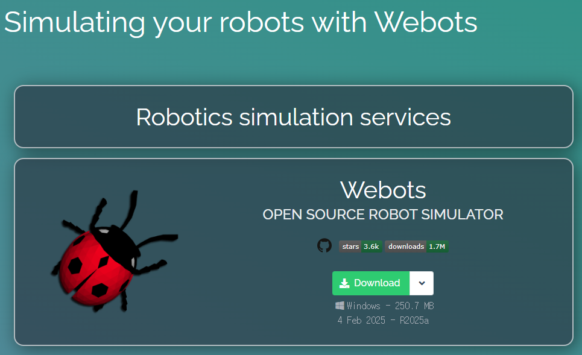
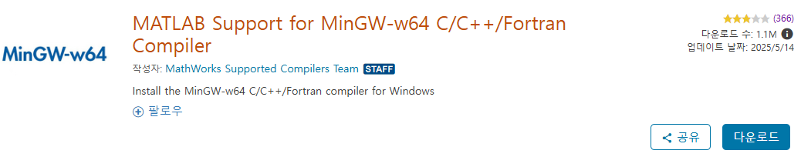
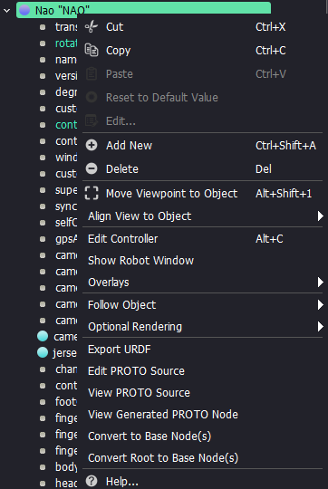
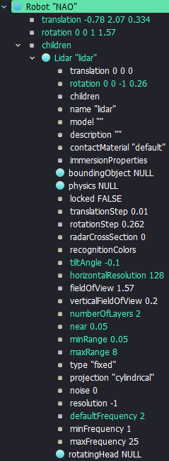
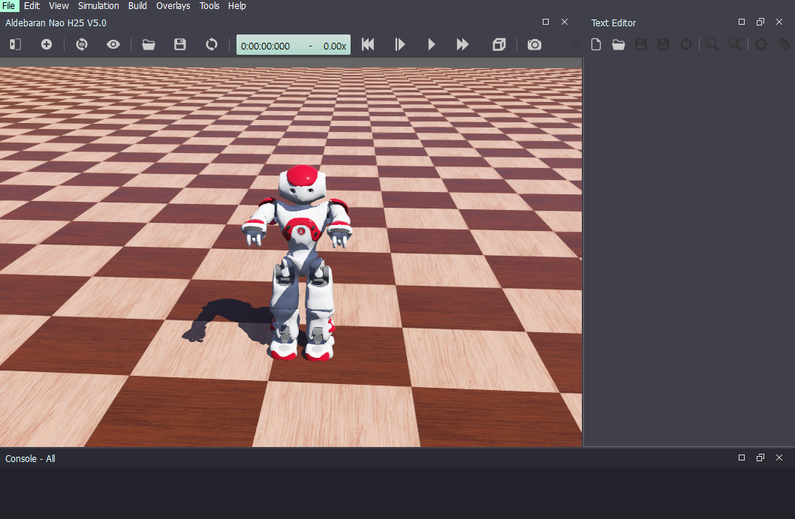
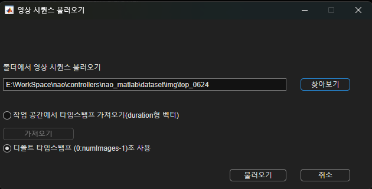
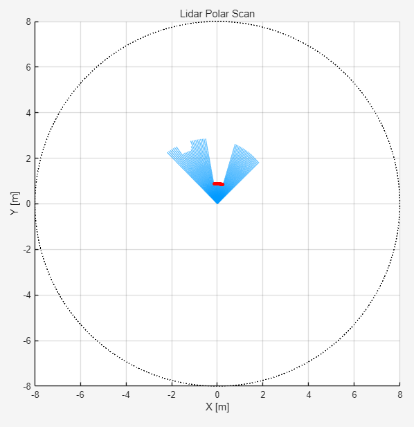
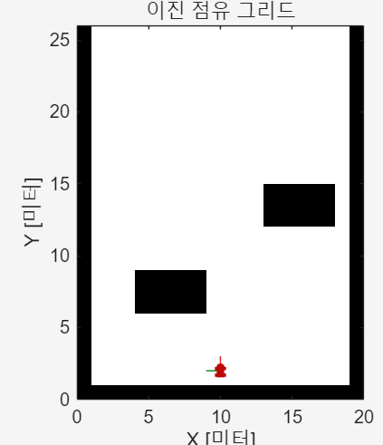
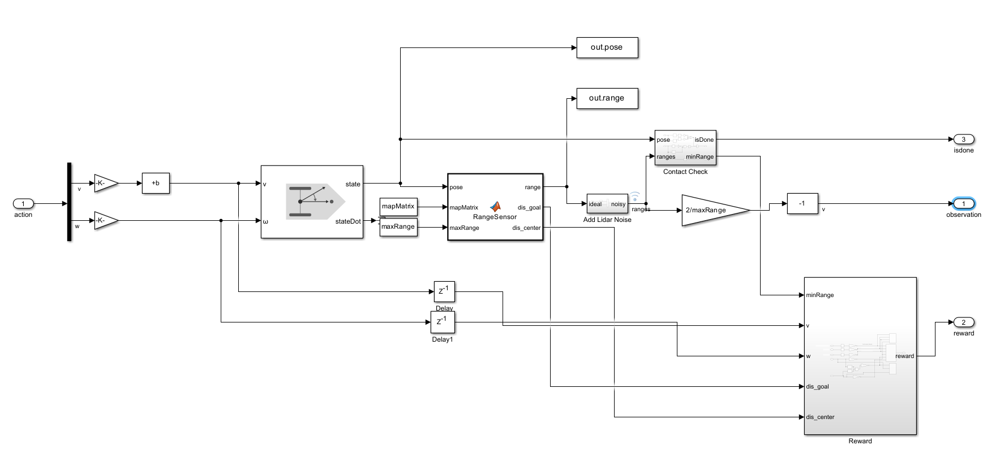
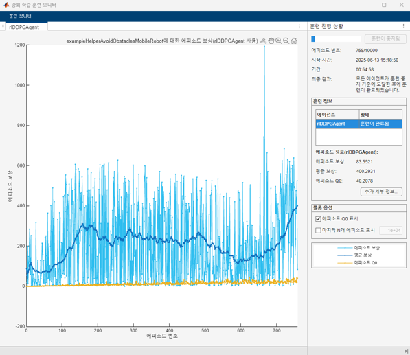

# Real-Time Obstacle Avoidance System for NAO

*MATLAB × Webots 프로젝트 가이드*

---

## 목차

1. [환경 구축](#1-환경-구축-webots--matlab-설치)
2. [Webots-MATLAB 통합](#2-webots--matlab-통합)
3. [시뮬레이션 환경 설정](#3-시뮬레이션-환경robot-obstacle-설정)
4. [오프라인 워크플로](#4-오프라인-워크플로)

   1. [데이터셋 수집](#41-데이터셋-수집)
   2. [Object Detection — YOLO v4](#42-object-detection--yolo-v4)
   3. [Path Planning — DDPG](#43-path-planning--ddpg)
5. [온라인 실행](#5-온라인-실행)

---

## 1. 환경 구축 (Webots & MATLAB 설치)

| 툴          | 버전        | 비고                                             |
| ---------- | --------- | ---------------------------------------------- |
| **Webots** | 2025a     | [Cyberbotics 공식 사이트](https://cyberbotics.com/) |
| **MATLAB** | R2025a 이상 | MinGW-w64 C/C++ Compiler 필수                    |

### 설치 절차

1. Webots 2025a 다운로드 및 설치 

2. MATLAB에 **MinGW-w64 C/C++ Compiler** 추가 설치
   *On Windows the MATLAB MinGW-w64 C/C++ Compiler needs to be installed in addition to MATLAB.* 
   설치 링크 → [https://kr.mathworks.com/matlabcentral/fileexchange/52848-matlab-support-for-mingw-w64-c-c-fortran-compiler](https://kr.mathworks.com/matlabcentral/fileexchange/52848-matlab-support-for-mingw-w64-c-c-fortran-compiler)

---

## 2. Webots-MATLAB 통합

### 프로젝트 폴더 준비

```text
C:\Webots\projects\robots\softbank\
```

위 경로의 **`nao`** 폴더를 통째로 복사하여 *자신의* 프로젝트 디렉터리로 이동합니다.
`nao\worlds\nao_matlab.wbt` 를 더블 클릭하여 기본 월드를 실행하세요.

---

## 3. 시뮬레이션 환경(robot, obstacle) 설정

Webots 왼쪽 트리(Tree) 창에서 로봇 및 센서 노드를 편집할 수 있습니다.

### 센서 편집 권한 해제

`Nao "NAO"` 노드 → **우클릭 > Convert Root to Base Nodes**

### 3.1 Lidar 센서 추가

1. `Robot "NAO"` → **children** → *Add* → `Lidar`
2. 주요 파라미터

   | 파라미터                   | 값        |
   | ---------------------- | -------- |
   | `tiltAngle`            | `-0.1`   |
   | `horizontalResolution` | `128`    |
   | `numberOfLayers`       | `2`      |
   | `near` / `minRange`    | `0.05 m` |
   | `maxRange`             | `8 m`    |
   | `defaultFrequency`     | `2 Hz`   |

    

### 3.2 카메라 해상도 변경 (선택)

`Robot "NAO"` → `DEF HeadYaw Hinge2Joint` → `endPoint Solid` → `Camera "CameraTop"`
*width 640*, *height 480* 

### 3.3 장애물 추가

`Floor "floor"` 선택 → 상단 **＋** → *PROTO nodes (Webots Projects) → objects* 에서 원하는 오브젝트 삽입

---

## 4. 오프라인 워크플로

### 컨트롤러 교체

Webots는 기본적으로 `nao\controllers\nao_matlab\nao_matlab.m` 스크립트를 로드합니다.
작업별 스크립트(`nao_matlab_*.m`)를 작성한 뒤 **내용을 복사–붙여넣기** 하고 Webots에서 *Reload* 하면 즉시 반영됩니다. 

### 4.1 데이터셋 수집

#### 4.1.1 이미지 데이터셋

1. `nao_matlab_mk_img_dataset.m` → `nao_matlab.m` 으로 복사
2. 실행하면 `frame_*.png` 형식으로 이미지가 저장됩니다.
3. 품질이 낮은 프레임 삭제 후 `frame_namer.mlx` 로 번호를 0-padding 형태로 일괄 수정

   ```
   Renamed: frame_1.png   → frame_0001.png
   Renamed: frame_2.png   → frame_0002.png
   ...
   Renamed: frame_293.png → frame_0221.png
   ```

#### 4.1.2 라벨링

`비디오 레이블 지정기(Video Labeler)` 앱 → 비디오 시퀀스 불러오기 → 클래스별 라벨 생성 & 수동 라벨링 

### 4.2 Object Detection — YOLO v4

1. `yolo_model_make.mlx`

   ```matlab
   matFile = "./<dataset-path>.mat";  % 데이터셋 경로 지정
   ```

   순서대로 실행하면

   * 학습/검증 데이터 구조 생성
   * YOLO v4 네트워크 학습
   * 정밀도(Precision) · 재현율(Recall) 평가
   * 임의 이미지에서 검출 결과 시각화
   * 네트워크 구조(`analyzeNetwork`) 확인
   * 최종 모델 저장 → **`detector_nao_0630.mat`**

2. **모델 경량화(Quantization·Pruning)** → *Future Works*

### 4.3 Path Planning — DDPG

#### 4.3.1 Lidar 데이터셋 & RL 환경

1. `nao_matlab_mk_lidar_dataset.m` → `nao_matlab.m`

   * 실시간 Lidar 시각화
   * CSV 로 데이터 로깅 


2. `avoid_obstacle_lidar.mlx`

   * Lidar CSV 읽기 → **DBSCAN** 으로 군집화 → 장애물 위치 추정
   * Occupancy Grid 생성 
   * Simulink 기반 RL 환경 구성 → DDPG 학습 
   * doTraining 변수를 통해 학습을 새롭게 할지 아니면 이전 학습된 모델을 사용할 지 결정
   * true 로 하였을 떄 학습 실행
   


>

3. `avoid_obstacle_robot.mlx`

   * 학습된 에이전트 검증
   * Pure Pursuit 추종 알고리즘 적용

---

## 5. 온라인 실행

최종 통합 스크립트: **`nao_matlab_online_walk.m`** → `nao_matlab.m` 에 복사 후 Webots 실행

* 강화학습 기반 경로(waypoints)를 실시간 생성
* Pure Pursuit 로봇 제어(전진·좌·우 스텝)
* Object Detection 결과와 Lidar 장애물 맵을 HUD 에 동시 시각화

---


